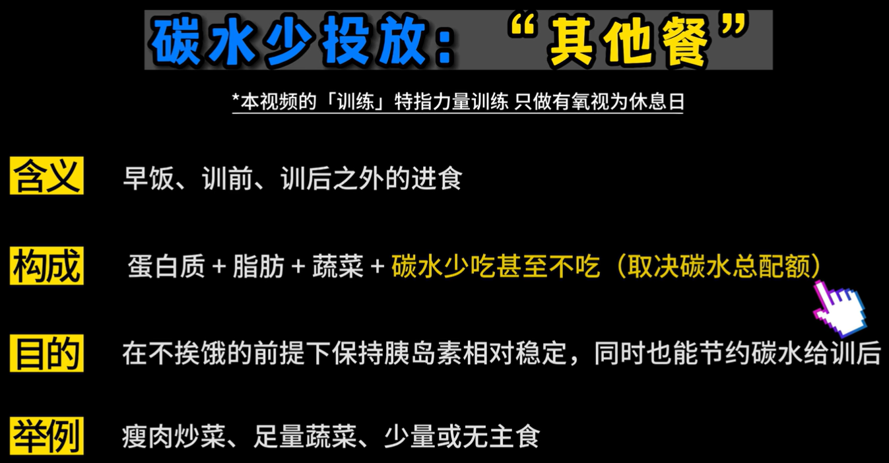

# 减脂：可以影响一个人的外部形状，包括脸型
- 训练一般纯指力量训练，只做有氧视为休息日
- 分析饮食不是看健康不健康，而是看碳蛋脂的总量和分配对不对，例如本文中的案例介绍
- 训后餐半个小时内吃碳水增肌，其他时间吃碳水是增脂
- 要了解常见食物的碳蛋脂的比例，减脂还是得做点计划，知道自己什么时候吃，吃啥
- 没经验的人，“按感觉”吃饭，这样的碳蛋脂的配比很不准确
- 先学会吃饭，再学有氧

- 常见的能量消耗公式
    - 500g脂肪 = 4500大卡 = 1125g碳水 = 4.5kg米饭，那么：**1g碳水 = 4g米饭**
- 常见单位换算
    - 1斤 = 500g
    - 能量单位，1 kcal = 1000卡路里

## 理论：三层递进关系
### 1 每天吃饭可以减少 10%-20% 热量（制造热量缺口）
- 根据能量守恒原理，**热量摄入** = **基础代谢**（静息时身体的消耗/类似手机息屏时的耗电量） + **活动消耗**（运动）
- 热量摄入 < 基础代谢 + 活动消耗，其中小于的范围在 10%-20%
- Thermic Effect of Food，**食物热效应**：我们摄入食物后，需要将这些食物分解成氨基酸...所需要的能量。
    - 其中分解蛋白质所需要的能量最高。
    - 碳水：脂肪：蛋白质 = 5%：5%：30%


### 2 特定的碳蛋脂的比例
- **热量摄入 = 碳水 x 4kcal + 蛋白质 x 4kcal + 脂肪 x 9kcal**
    1. 3g碳水 + 2g蛋白质 + 0.8g脂肪（第一个方案减脂效果**最好**）
    1. 4g碳水 + 1g蛋白质 + 0.8g脂肪（蛋白质摄入不足）
    1. 4g碳水 + 2g蛋白质 + 0.4g脂肪（脂肪摄入不足）
    - 注意：以上的单位 **g**，克，是指每**公斤**体重的日摄入量


### 3 碳水一天中摄入的 timing（时机）
#### 3.1 热量的摄入部分
- 碳水放在一天中不同的时间去吃，就可以人为的操纵胰岛素的升降，从而影响减脂效果

- 因为吃了东西不一定会完全吸收，而且身体吸收吃的食物的过程是需要消耗能量的，所以，一般“考虑吸收率”或者“考虑热效应”任意一个就可以（因为最终我们只需要计算相对的10%-20%热量缺口就行）

- 经验化找热量缺口，注意以下几点
    - g是指 g/kg
    - 以**两周**为单位，能掉体重就维持配置的碳蛋脂比例
    - 只下调碳水，且最低不能低于2g ??(可以自己实验，到2g的时候再继续减，找自己的节奏，但可能影响上学上班的状态了，请知悉)
- 注意，**吃太少会影响基础代谢，没有热量差**

```
练习：
因为我已经很久没训练了，且每周的运动以羽毛球（有氧运动）为主，之前一周三练，所以我可以按照
碳水 : 蛋白质 : 脂肪 = 3g : 1.5g : 0.8g
```


#### 3.2 每天体重变化的因素
- 空腹
    - 早晨空腹，一般是指大肠空了，但是小肠没空
    - 医院空腹：禁食12小时，提前6小时吃泻药
    
- 人体的脱水吸水
    - 碳水摄入量，能影响肌糖原（肌肉里的淀粉）的存储量，**1g肌糖原能留住3g水**，所以人体内500g的肌糖原变化，就能引起身体1500g（3斤，水）的体重变化
    - 水钠平衡
        - 降盐喝水 -> 迫使人体钠离子浓度稀释/变低 -> 水钠平衡的破坏，迫使人体主动排水 -> 人体体重迅速下降（掉的全是人体的水分）
        - 低碳低盐脱水快速掉体重，高碳高盐吸水增体重
- 人体肌肉量和脂肪量的变化（对体重短期的影响微乎其微）


综上，建议以**两周**的时间为单位，观察人体的体重和体脂率，短期内的体重就像下列图片展示的一样，很容易受食物和水分的影响


#### 3.3 一天中碳蛋脂总量的分配
可以人为的操纵胰岛素，从而在减脂期间多掉脂肪少掉肌肉
胰岛素：转运血液里的葡萄糖、氨基酸等营养物质，进入肌肉和脂肪组织
这样，胰岛素作为合成激素，既能增肌也能增脂
- 无力量训练 + 高胰岛素 = 增脂
- **力量训练** + 高胰岛素 = **增肌**增脂

所以：
- **力量训练**后，吃**训后餐**，故意升高胰岛素来增肌
- 其他时间（没有力量训练的时间/休息日），保持胰岛素的稳定就行，减少增脂

下图说明：
- 不管我们吃啥，都能刺激胰岛素的分泌
- 碳水对胰岛素的刺激最强


利用这一点，把控好我们吃碳水的 Timing：
1. 训后餐（**力量训练**后**30分钟之内**，必吃）
    - 训后餐的构成 = 全天50%的**碳水** + 30-50g蛋白质 + 20g低脂
        - 注意训后的**碳水**，最好是 **高GI 碳水**，肠胃吸收快，葡萄糖释放快，血糖短时间迅速升高，导致胰岛素大量分泌，以降低血糖水平
        - 蛋白质也高，是为了修复肌肉提供原料
        
    - 怎么吃
        - 正餐（米饭馒头 + 瘦肉）
        - 速配餐（便携快碳+蛋白粉）垫一下 + 正餐
        - 只吃速配餐（便携快碳+蛋白粉）
    - 便携快碳，碳水是脂肪的5倍以上的精致快碳（主要成分是米饭、糯米、面粉、白面包、土豆）
    

2. 早餐
    - 构成 = 全天30%的**碳水** + 蛋白质，低脂无要求
    - 不建议油条、麻团等**油炸的碳水和脂肪混合物**中获取碳水，不然早餐就会花掉全天大部分的脂肪额度
    - 建议选择 燕麦片、燕麦麸、玉米粉、藕粉、芝麻糊等，再加上蛋白粉 

3. 训前餐
    - 构成 = 全天20%的**碳水** + 蛋白质，低脂无要求
        - 注意训前的**碳水**，只要是中等或中高GI碳水即可 + 蛋白质可吃可不吃 + 不吃脂肪
    - 粗粮面包、玉米、香蕉、葡萄干、蔗糖饮料(脉动、冰红茶、宝矿力等)等
    - 到健身房吃都可以（因为热身、换衣服会消耗30分钟左右的时间），在正式组15-30分钟前吃

4. 其他餐
    - 不能抢**训后餐的碳水**，给其他餐      

#### 3.4 力量训练的餐食分配方案
  

#### 3.5 休息日餐食分配原则
- 有氧运动也算作休息日
- 休息日不需要注意碳水的分配时间，每一餐**碳蛋脂**混合均匀即可
- 休息日的碳水应该比力量训练期间应当减少（因为没有力量训练，不要故意去升高胰岛素刺激增脂）。但是蛋白质和脂肪不变
- 建议碳水减少到**1.5g-2g/kg**，每一餐都有一碗米饭，保持胰岛素全天稳定

### 4 食物来源
#### 4.1 碳水食物（碳水率 + 分解速度）
- 碳水率：100g 这种食物里面有多少 g 碳水
- 分解速度：这种食物分解为葡萄糖的速度
    - 高中低 **GI（Glycemic Index） 碳水**/快碳慢碳
    - 所有的碳水只有分解为葡萄糖后才能进入血液供葡萄糖利用
    - GI越大，一吃下去，身体的血糖上升的很快，就说明该食物分解为葡萄糖的速度很快


- 西瓜的碳水率为8%，那么要吃50g碳水，就需要吃 50÷8%=625g 西瓜
- GI的测定方法：以葡萄糖水（GI=100）为参考，摄入**50g**碳水在**120分钟**内血糖曲线下方**面积**


- **训后餐**一定要吃**高GI**的食物，其他餐随意
- 胰岛素的影响因素有很多，所以不能只论快慢碳
    - 碳水GI（正相关）
    - 碳水、蛋白质的用量（正相关）
    - 纤维素的用量（负相关）
    - 进食的顺序


#### 4.2 脂肪的食物来源
- 正确的观念：就算是重油重盐的一盘菜，夹一片也不会有多少油，只要不是喝油汤、舔盘子，因为菜品表面能附着的油量很有限，所以不要不吃炒菜/食堂炒菜正常吃
- 只要注意少吃吸油炒菜/固体脂肪

- 估算的方式参考


- 平时多注意 **脂肪刺客**，少吃（能吃，但是注意自己的每天的脂肪配额）
    - 瓜子、开心果、花生
    - 红烧肉、五花肉、带皮肉（难怪UP主不吃鸡肉的皮）
    - 辣条、士力架、方便面、薯条、薯片

- 不用专门追求**优质脂肪**
    - 饱和脂肪酸、单不饱和脂肪酸、多不饱和脂肪酸之间的比例，大多数推荐为1:1:1附近
    - 没有什么谁脂肪优质或劣质，都是人体必需的
    

#### 4.3 蛋白质的食物来源

- 3g/kg以内的蛋白质摄入是不会损害肾功能的
- 维持肌肉一般2g/kg就行，超过2g/kg以上，对维持肌肉就是多余的了，多余的蛋白质的性质就是单纯的提供热量而已。所以在减脂期间有热量缺口，体重在缓慢下降，蛋白质多吃点也问题不大

- 这些蛋白食物会附赠脂肪或者碳水，不能作为蛋白质的主要来源，除非纯吃：
    - 鸡蛋白（不吃蛋黄）、蛋清液、脱脂牛奶

- 多在食堂找**瘦肉**
- 外卖推荐（一定要**去皮**）

- **食物的配置，主要就是解决蛋白质**（因为脂肪和碳水一般会随着蛋白质附赠）
- 不用纠结要不要去除植物蛋白这个问题（因为占比极低）


### 5 有氧运动
- 其实**力量训练**是最简单的，按照计划/配重/组数就可以维持现状
- 热量缺口 = 减少饮食 + 做有氧运动
    - 减脂前种期，碳水在 2.5-3.5g/kg 阶段，只需要通过减少饮食/注意饮食，来提供热量缺口是很容易的，这时花时间做有氧会不太划算
    - 减脂后期，碳水在 2-2.5g/kg 时，因为感觉吃的很少，单纯的用饮食制造热量缺口的难度会很大，这时结合有氧会变得很划算
    - 另一个思路是，如果不想再次降低当前碳水的配额，那么可以加入有氧来减脂

- 只做有氧，长时间有氧（40-60分钟）~~或者力量训练 + 20min的短有氧~~
    - 不建议：力量训练后，再接40-60分钟的长有氧，因为这样会影响训后餐的进食时间，会损失训后的增肌窗口期，浪费自己的力量训练
    - 不建议：每周超过5小时的有氧运动？

- 有氧选择什么方式不重要，重要的是心率，在120-150次/分钟
- 常见的有氧
    - 跑步、游泳、羽毛球、爬楼、爬山
    - 跑步机有氧
        - 平坡跑步
        - 陡坡慢走


## 案例 - 新手如何规划自己的减脂

- 先看碳蛋脂各自和体重的比例
- 再看各餐的碳水分配，尤其是训后餐的碳水（用于增肌）
```
注意新手减脂，男生之前有写，建议：碳水 : 蛋白质 : 脂肪 = 3-3.5g : 1.5-2g : 0.8g
```

- 光是饮食就制造出来57%的热量缺口，随便做点有氧运动，热量缺口直接升到70%+


- 这样会造成新陈代谢减少，减掉的是身体的水份和肌肉的分解，从而不会减脂，还对身体造成损害
- 正确的调整
    - 19%的热量缺口
    - 特定的碳蛋脂的比例
    - 碳水的时机，适配力量训练


## 减脂入门的正确观念
- 吃啥不重要，搞清楚碳蛋脂的总量和分配才是最重要的
    - 清楚了食物碳蛋脂的配比，就算是垃圾食品也能开心吃
- 减脂不是无原则的少吃多动
    - 热量缺口10-20%即可，再大会伤害基础代谢
- 训后餐一定要吃，并且是在力量训练后的30分钟之内吃
- 注意饮食是人自己配置的，吃自己喜欢吃的，注意饮食的舒适性和可持续性
    - 一般的炒菜正常吃（但是坚决不吃吸油的食物和固体脂肪），所以不一定要吃水煮
    - 把有限的脂肪配额花在自己喜欢的食物上
    - 利用训后餐，吃精制碳水和甜口食物


# 致谢
[B站 好人松松 UID:2078781964](【💪🏻B站版《健身新手的减肥减脂完全手册》™】https://www.bilibili.com/video/BV1AM411r7z3)