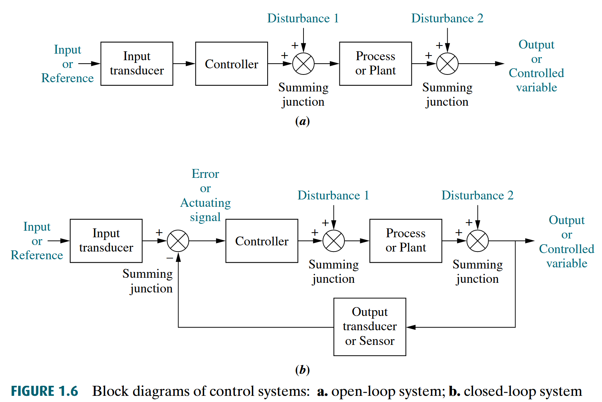

# Control System Engineering, NORMAN S. NISE
- steady-state error    稳态误差

## Chapter 1: Introduction
- “The open-loop system cannot correct for these disturbances.”  这意味着，开环系统无法通过校正干扰来得到正确的输出

```
Or assume that you calculate the amount of time you need to study for an examination that covers three chapters in order to get an A. If the professor adds a fourth chapter—a disturbance—you are an open-loop system if you do not detect the disturbance and add study time to that previously calculated. The result of this oversight would be a lower grade than you expected.
所以，让自己做一个 Closed-Loop (Feedback Control) Systems ！！
```
- In summary
    - Systems that perform the previously described measurement（执行先前的描述，指前一个 Output） and correction are called **closed-loop, or feedback control, systems**.
    
    - Systems that do not have this property of measurement and correction are called **open-loop systems**.
